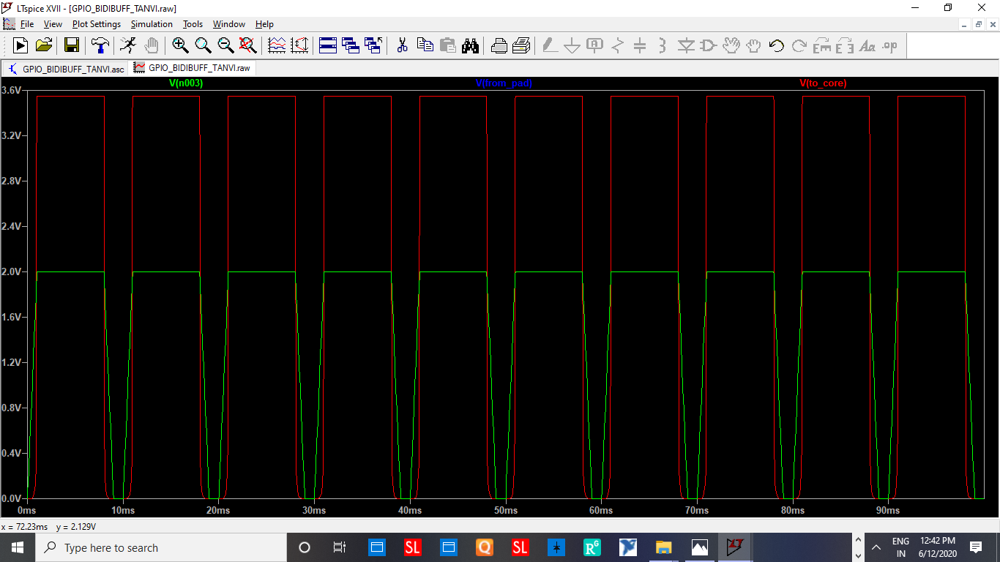
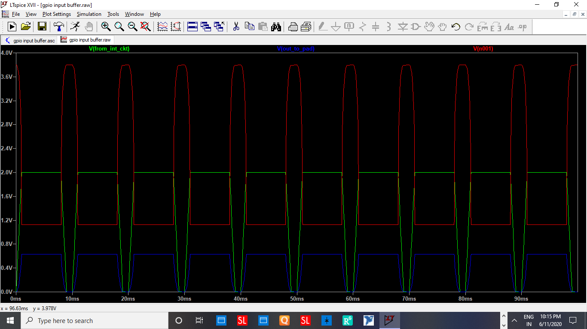
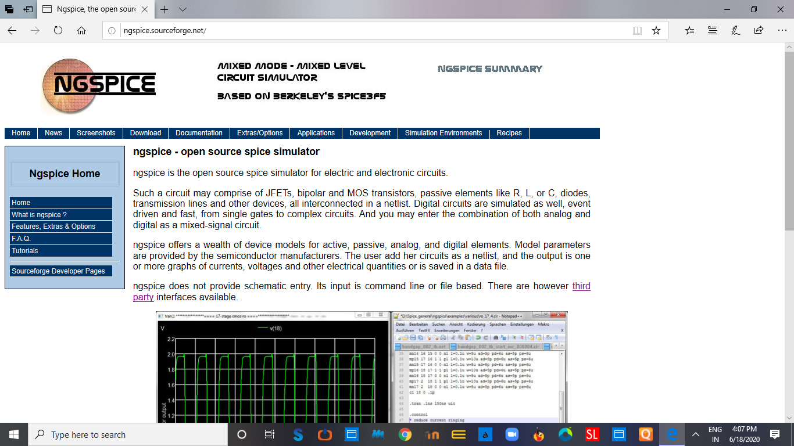
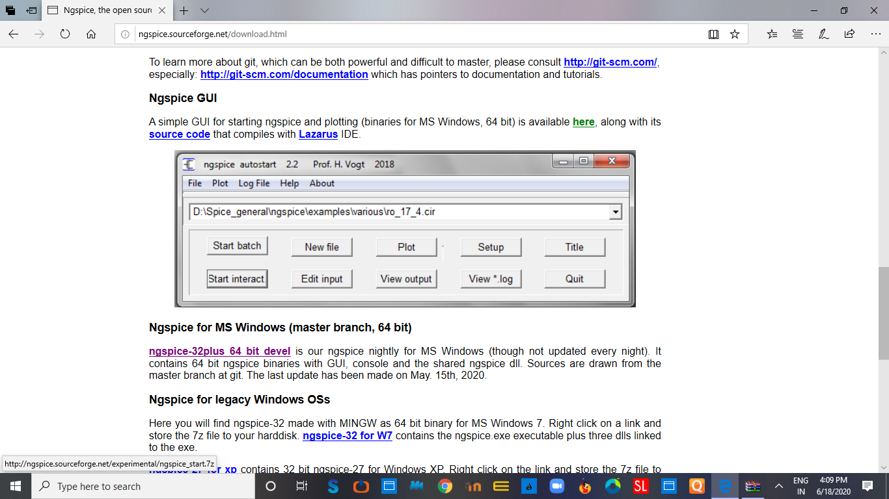
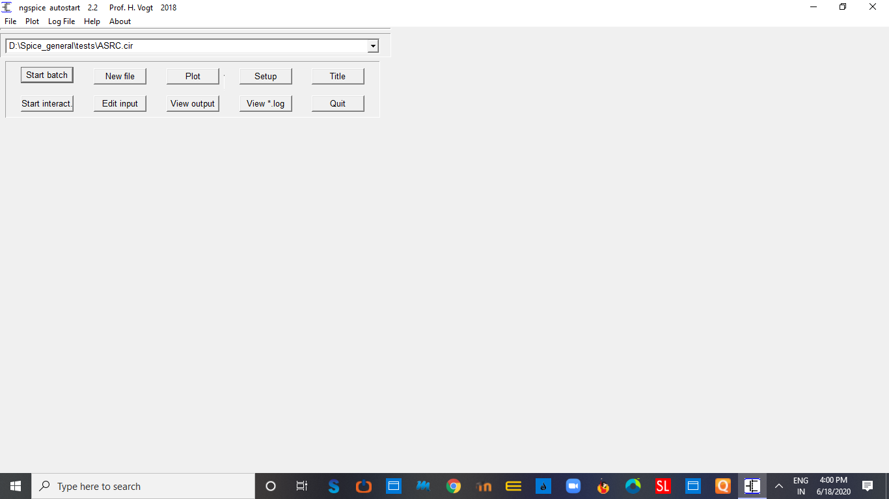
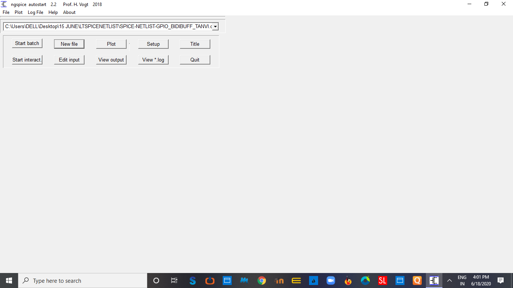
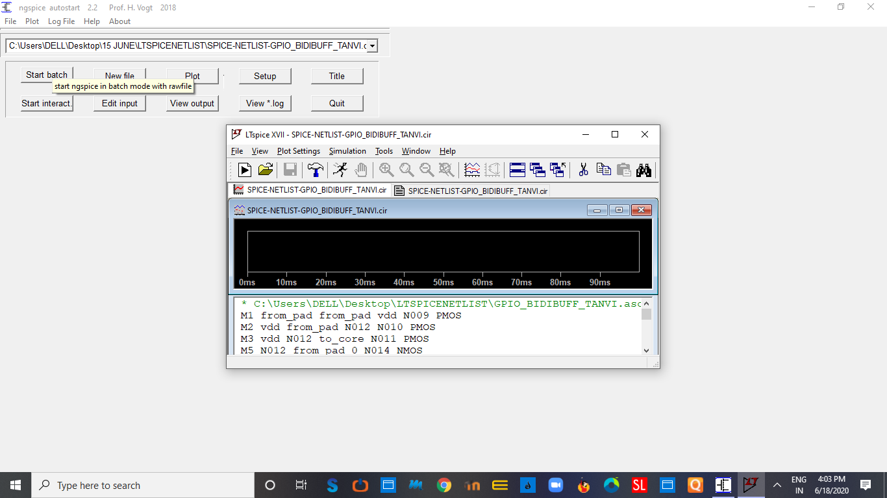
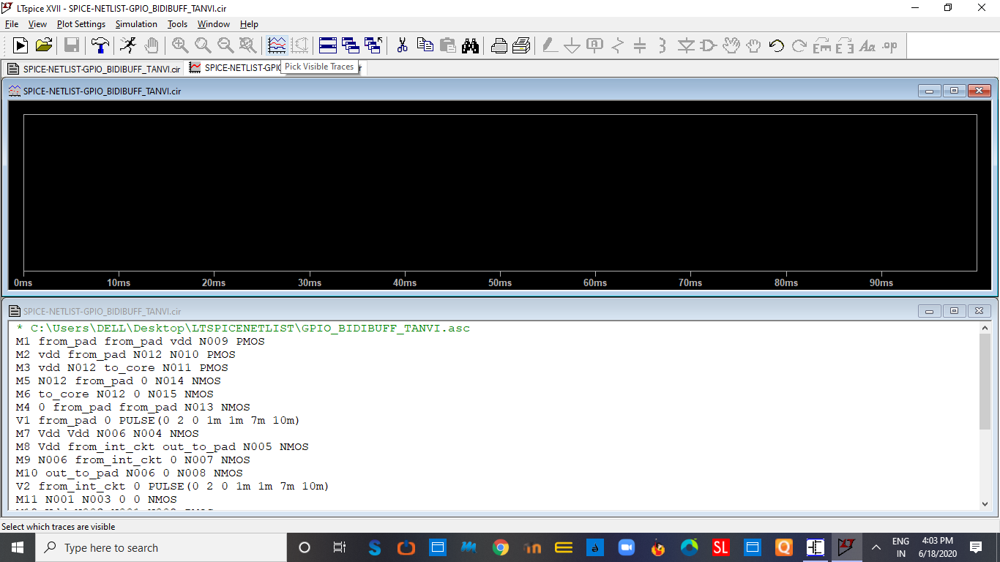
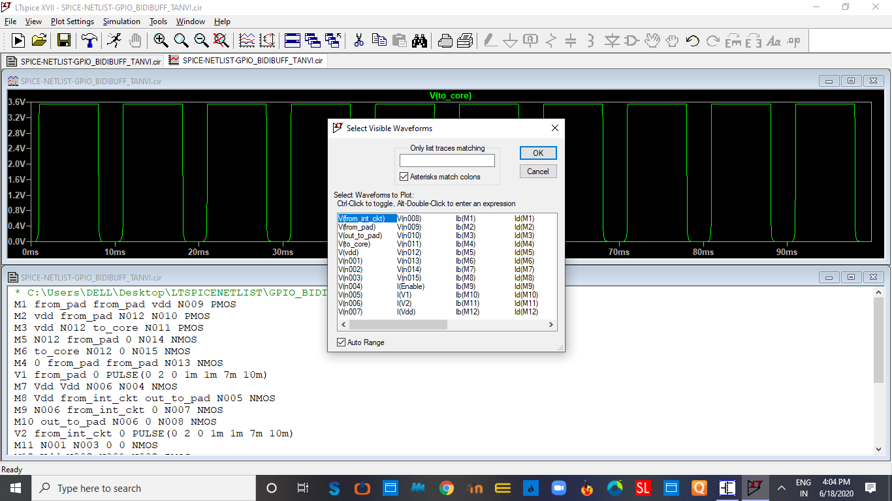
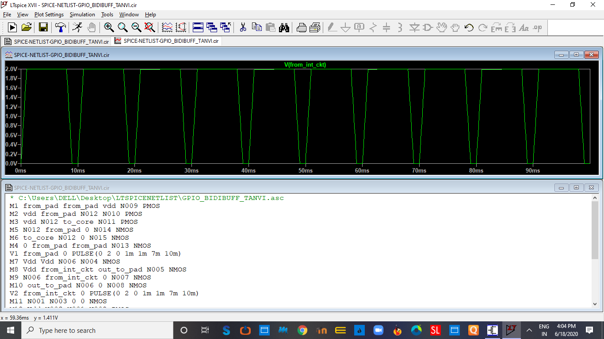

# BIDIRECTIONAL BUFFER
This project discusses the BiDirectional Buffer and implementation of General Purpose Input Output(GPIO).GPIO circuit is implemented using MOSFETS' only and it is all Mosfets' implementation.

# TOOL USED
LTspiceXVII is used to simulate the General Purpose Input Output(GPIO). LtspiceXVII is a spice simulation software produced by semiconductor manufacturer Analog Devices. Schematic of circuits and the waveforms can be obtained easily from this tool.

# INSTALLING LTSpiceXVII

   FOR Windows AND MacOS

  1.Download LTspice from https://www.analog.com/en/design-center/design-tools-and-calculators/ltspice-simulator.html 
  
  2.Follow basic installation steps and install LTspice simulatorXVII on your Windows system or Mac.You can download according to your       operating system.

   FOR LINUX OS
	
   1.LINUX Users have to install WINE from https://wiki.winehq.org/Download as LTSpice is not directly supported.
   
   2.Similar steps are followed as mentioned for windows to download LTspice setup.
   
   3.Right click on the downloaded setup file and select the option Open With Wine Windows Program Loader.
   
   4.Afterwards basic installation steps are followed.
	
# SCHEMATICS AND SIMULATIONS

  1.After installation Go to New schematic option on top left and draw circuit schematic using components available on top.
  
  2.Go to Edit->Spice Directive’S’ to edit text on the schematic. Also provide input voltage as required by clicking right button and then advanced and changing input form as required. Save circuit with extension (.asc).

  3.To open file which is already created,Go to File->Open(Ctrl+O) and select file with .asc extension.

  4.Go to Simulate->Run to obtain waveforms.

  5.You can select parameters you want to display or directly click on that part of circuit(to be displayed). 

  6.SPICE NETLIST can be obtained from View->SPICE Netlist.
# circuit of gpio

# GLANCE AT WAVEFORMS OF GPIO

FIG-INPUT BUFFER--1 , ENABLE(Vn003) = 1 

FIG-OUTPUT BUFFER , ENABLE(Red,Vn001)=0

FIG-INPUT BUFFER--2 , ENABLE(Vn003)=1

# simulation by ngspice

ngspice is the open source simulator.

here are steps to download ngspice through which we will run .cir netlist generated in ltspice

1.download ngspice

2.download ngspice gui

3.unzip it.

4.DuSpiceStart.exe will appear on specified path ,open it. 

5.click on new file and add your .cir file.

6.in ng spice setup set it for ltspice

7.click on start interact.

8.ltspice will open and click on  traces.

9.select parameters.

10.waveform is displayed.

# CONTACT INFORMATION
I.TANVI ARORA,ECE,Deenbandhu Chhotu Ram Universiy of Science and Technology,Murthal,Haryana. tanviarora1058@gmail.com

II.KUNAL GHOSH Director, VSD Corp. Pvt. Ltd. kunalpghosh@gmail.com

III.PHILIPP GÜHRING Software Architect at LibreSilicon Association pg@futureware.at

IV.Dr. GAURAV TRIVEDI Co-Principal Investigator, EICT Academy,
and Associative Professor, EEE Department, IIT Guwahati trivedi@iitg.ac.in
